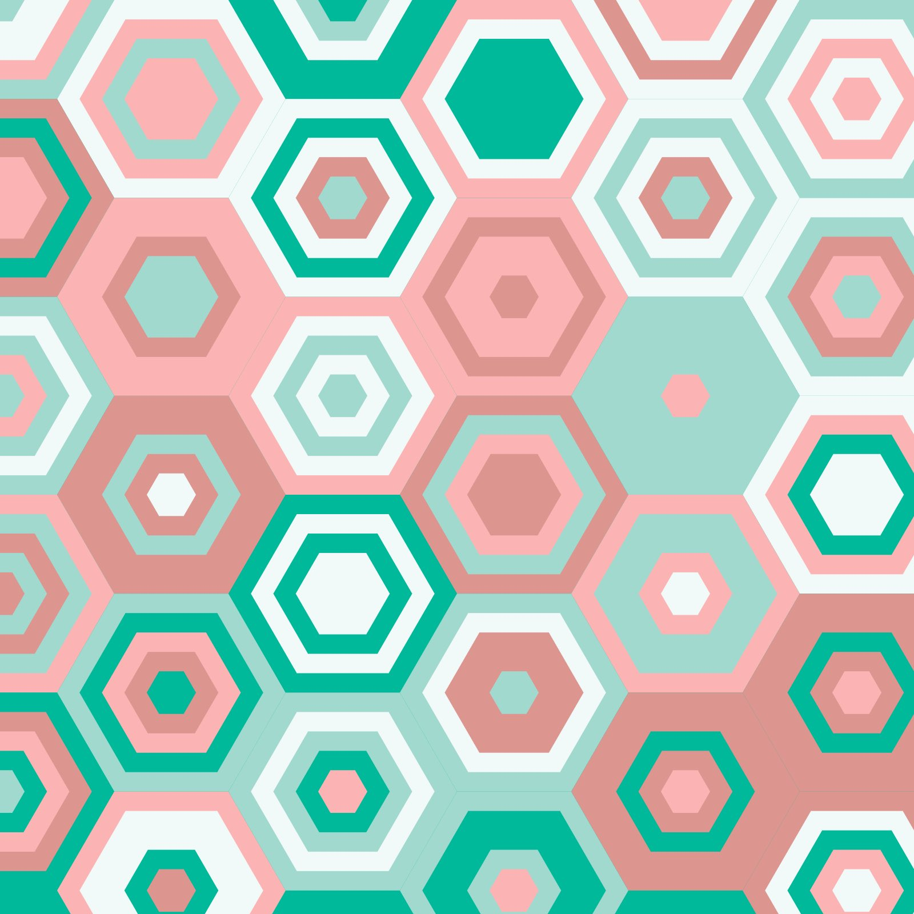

# zguo0682_9103_Tut1_Major_project
## Individual part
1. **How to interact with it.**  
Please click the **Play/Pause** button located at the center bottom of the window and wait for the music to start. 

2. **Approach to animate group code**  
- In individual code, the level of audio was chose to drive the code.  
  - For the **large circles** in the foreground, the biggest circle in each of the large circle will remain unchanged, but the layers inside the large circle will increase their sizes with the increase of level of musis, up to the same size of the biggest circle. Besides, the layers closer to the centre of large circles are affected more by the changes of level of music. This allows different layers to reach the maximum size, the size of biggest circles, at the same time when affected by change of level of music.  
  - For the **beads** in the background, on the one hand, the sizes of them decrease with the increase of the level of music, on the other hand, the opacity of them also decrease with the increase of the level of music.  
  
3. **About inspiration**  
  
[Click here to see the gif of inspiration artwork](https://x.com/yuta_0_p5/status/1745051881007972689/video/1)    
This artwork inspired me because the main pattern of it, the hexagons, are also compsed of multiple layers, similar to the large circles we created in our group code. In this artwork, the inner layers of the hexagons expand until they fill the whole hexagons, with layers closer to the center expanding more quickly, making the interior dynamic but mataining a static outline. This feature allows it to show the dynamism without making the visuals of whole work overly chaotic, which is the key reason I find it suitable for a music-driven work.  

4. **Technical explanation**  
In the individual code:  
  - Firstly, the amplitude analyser was created to get the data of level changes of music.  

  - Secondly, the initial statuses of large circles and beads are created.  

  - Then the map() was used to remap the changes of level detected by analyser from the original range to the new ranges.    
    - For the sizes of inner layers of large circles in the foreground, the new range is from the initial size of each layer to the size of the biggest circle.
    - For the sizes of beads in the background, the new range is from the initial size of bead to 0.
    - For the opacity of beads, the new range is from 100% to 20%.  

  - And finally, a button was created to control the start and stop of the music. Whenever the music is detected as playing, the analyser will get the data of level of music, making the work dynamic.